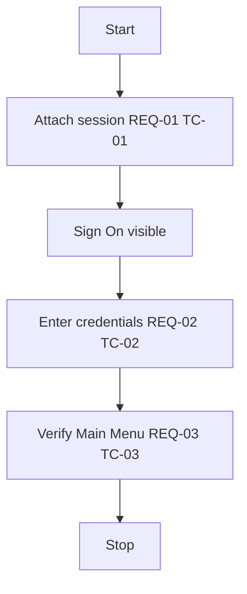
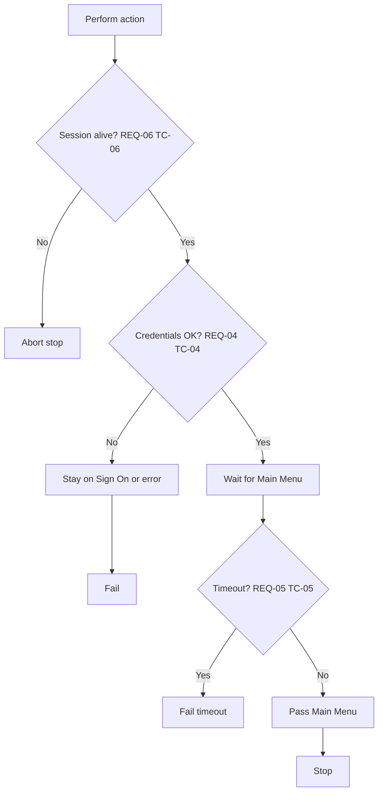
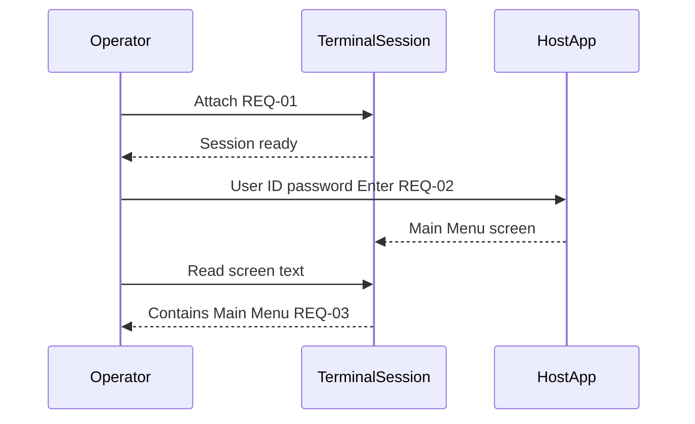

# Logic diagrams: Sign On → Main Menu

| Field | Value |
|-------|-------|
| Spec | [SAMPLE-flow.en.md](../specs/SAMPLE-flow.en.md) |
| Test cases | [SAMPLE-flow.en.md](../testcases/SAMPLE-flow.en.md) |

## 1. High-level flow (REQ-01 … REQ-03)

## 2. Decisions and error paths (REQ-04 … REQ-06)

## 3. Sequence (happy path)

