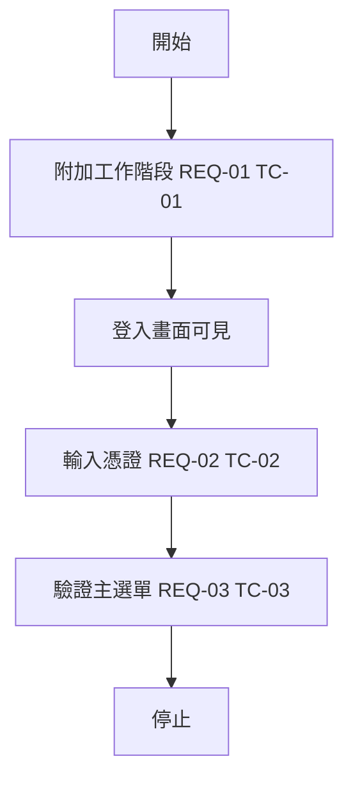
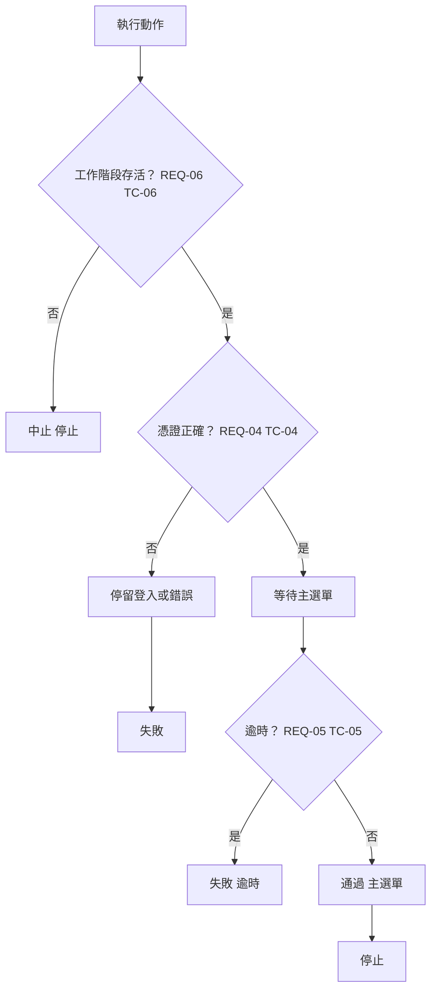
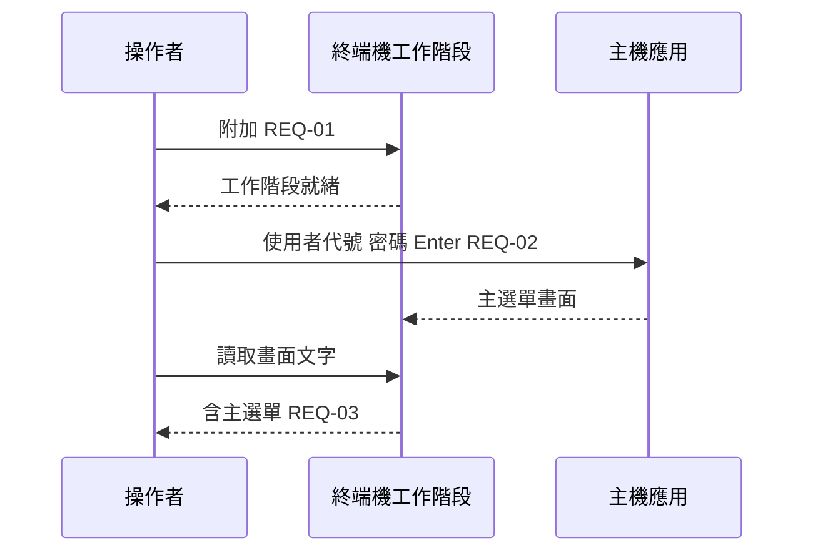

# 邏輯圖：登入 → 主選單

| 欄位 | 值 |
|------|-----|
| 規格 | [SAMPLE-flow.zh-Hant.md](../specs/SAMPLE-flow.zh-Hant.md) |
| 測試案例 | [SAMPLE-flow.zh-Hant.md](../testcases/SAMPLE-flow.zh-Hant.md) |

## 1. 高階流程（REQ-01 … REQ-03）

## 2. 決策與錯誤路徑（REQ-04 … REQ-06）

## 3. 成功路徑時序

