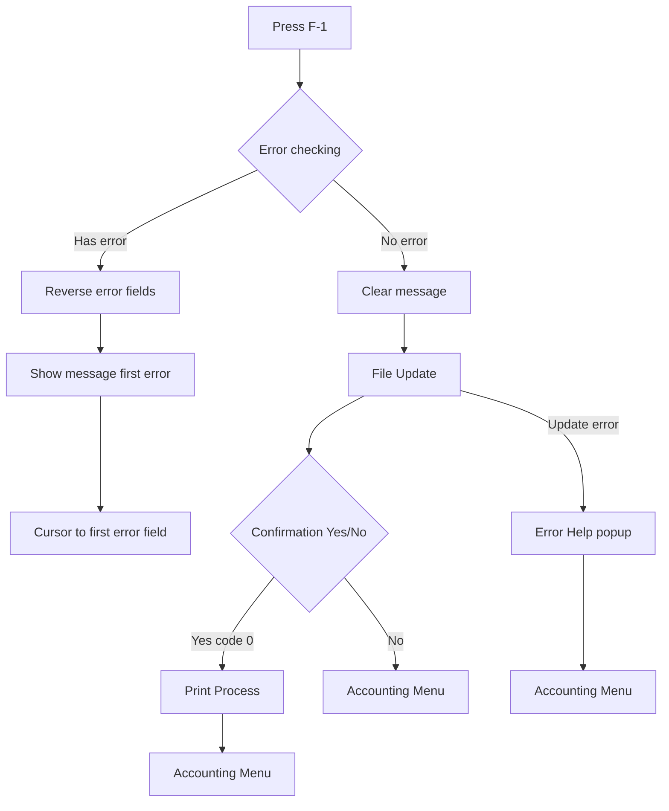
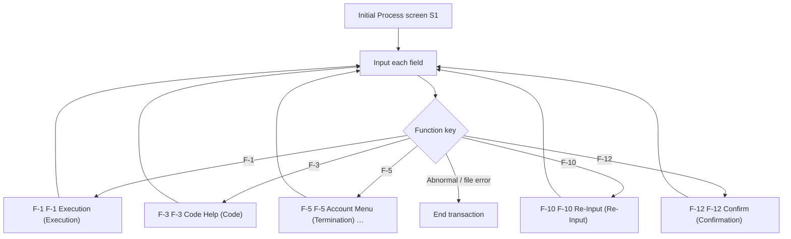
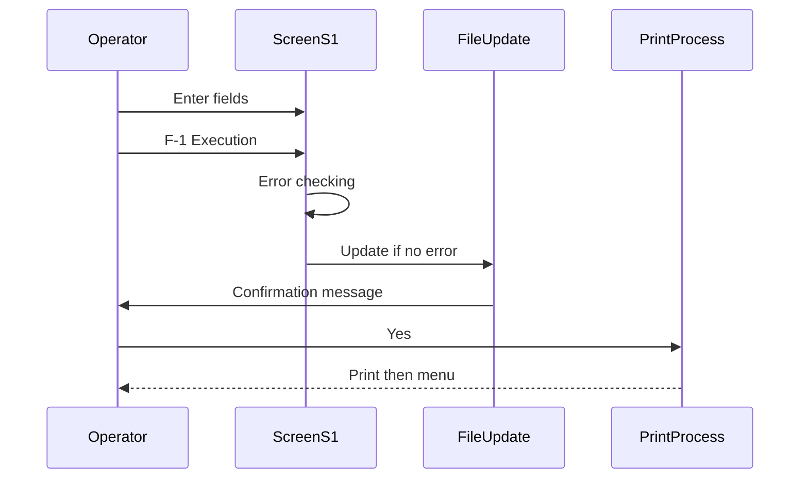
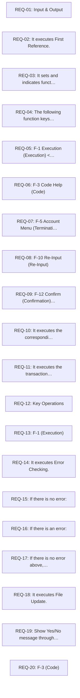

# Logic diagrams: Registration of Funds Transfer

Source: `specs\example _flow.en.md`

## 1. Chapter structure

```mermaid
flowchart TD
  root([Spec])
  root --> ch1["1 Summary"]
  ch1 --> ch1_I["I some text here"]
  root --> ch2["2 Input & Output"]
  ch2 --> ch2_I["I Input & Output Files"]
  root --> ch3["3 Specification"]
  ch3 --> ch3_I["I Initial Process"]
  ch3 --> ch3_II["II Main Process"]
  ch3 --> ch3_III["III Input Process"]
  ch3 --> ch3_IV["IV Error Checking"]
  ch3 --> ch3_V["V Print Process"]
  root --> ch4["4 Appendix"]
  ch4 --> ch4_I["I The Screen Layout<Registration of Fun…"]
  ch4 --> ch4_II["II The Report Layout<Registration of Fu…"]
  root --> ch5["5 Calculation & Setting"]
  ch5 --> ch5_I["I Setting of Branch Bank Account"]
  root --> ch6["6 First Reference"]
  ch6 --> ch6_I["I It sets the following initially."]
  ch6 --> ch6_II["II It indicates the screen."]
  root --> ch7["7 File Update"]
  ch7 --> ch7_I["I PHCNTF It executes the following if i…"]
  ch7 --> ch7_III["III For record update above, if the cor…"]
```

## 2. F-1 Execution decision (error check → update → print)

## 3. Main process loop

## 4. Happy-path sequence (F-1)

## 5. Requirement index (first 20)

