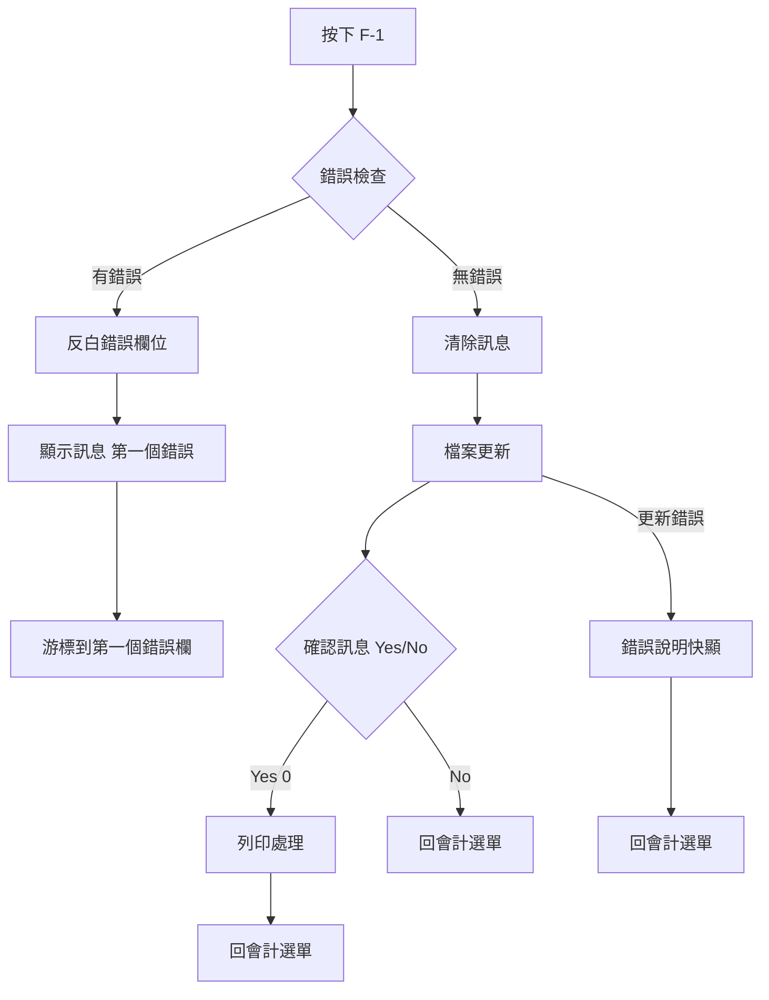
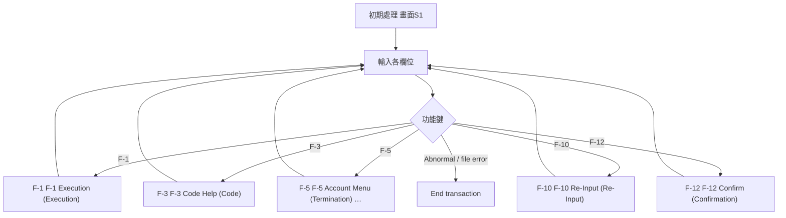
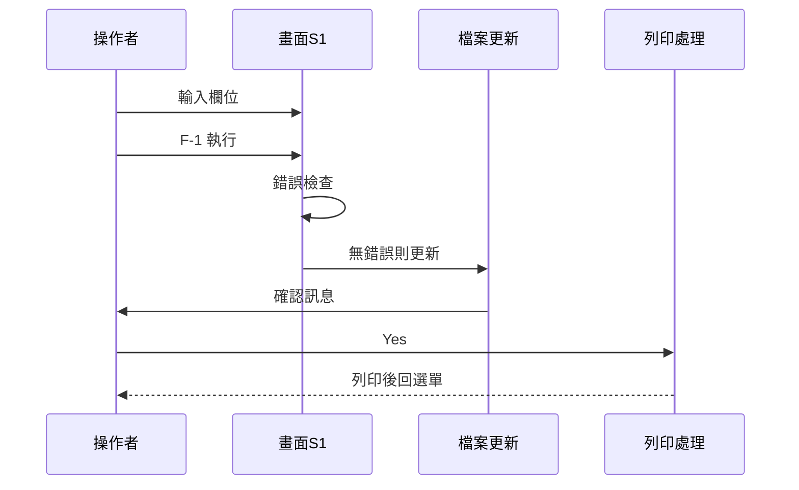
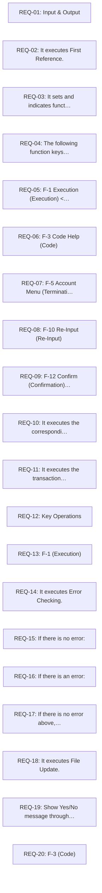

# 邏輯圖：Registration of Funds Transfer

來源：`specs\example _flow.en.md`

## 1. 章節結構

```mermaid
flowchart TD
  root([Spec])
  root --> ch1["1 Summary"]
  ch1 --> ch1_I["I some text here"]
  root --> ch2["2 Input & Output"]
  ch2 --> ch2_I["I Input & Output Files"]
  root --> ch3["3 Specification"]
  ch3 --> ch3_I["I Initial Process"]
  ch3 --> ch3_II["II Main Process"]
  ch3 --> ch3_III["III Input Process"]
  ch3 --> ch3_IV["IV Error Checking"]
  ch3 --> ch3_V["V Print Process"]
  root --> ch4["4 Appendix"]
  ch4 --> ch4_I["I The Screen Layout<Registration of Fun…"]
  ch4 --> ch4_II["II The Report Layout<Registration of Fu…"]
  root --> ch5["5 Calculation & Setting"]
  ch5 --> ch5_I["I Setting of Branch Bank Account"]
  root --> ch6["6 First Reference"]
  ch6 --> ch6_I["I It sets the following initially."]
  ch6 --> ch6_II["II It indicates the screen."]
  root --> ch7["7 File Update"]
  ch7 --> ch7_I["I PHCNTF It executes the following if i…"]
  ch7 --> ch7_III["III For record update above, if the cor…"]
```

## 2. F-1 執行決策（錯誤檢查 → 更新 → 列印）

```mermaid
flowchart TD
  startFk[按下 F-1] --> errChk{錯誤檢查}
  errChk -->|有錯誤| rev[反白錯誤欄位]
  rev --> msg[顯示訊息 第一個錯誤]
  msg --> cur[游標到第一個錯誤欄]
  errChk -->|無錯誤| clr[清除訊息]
  clr --> upd[檔案更新]
  upd --> conf{確認訊息 Yes/No}
  conf -->|Yes 0| prn[列印處理]
  conf -->|No| menu1[回會計選單]
  prn --> menu2[回會計選單]
  upd -->|更新錯誤| pop[錯誤說明快顯]
  pop --> menu3[回會計選單]
```

## 3. 主處理迴圈

```mermaid
flowchart TD
  init[初期處理 畫面S1] --> input[輸入各欄位]
  input --> key{功能鍵}
  key -->|F-1| fkF1["F-1 F-1 Execution (Execution) <File…"]
  fkF1 --> input
  key -->|F-3| fkF3["F-3 F-3 Code Help (Code) <It indica…"]
  fkF3 --> input
  key -->|F-5| fkF5["F-5 F-5 Account Menu (Termination) …"]
  fkF5 --> input
  key -->|F-10| fkF10["F-10 F-10 Re-Input (Re-Input) <It i…"]
  fkF10 --> input
  key -->|F-12| fkF12["F-12 F-12 Confirm (Confirmation) <I…"]
  fkF12 --> input
  key -->|Abnormal / file error| endNode[End transaction]
```

## 4. 成功路徑時序（F-1）

```mermaid
sequenceDiagram
  participant Op as 操作者
  participant Scr as 畫面S1
  participant Upd as 檔案更新
  participant Prn as 列印處理
  Op->>Scr: 輸入欄位
  Op->>Scr: F-1 執行
  Scr->>Scr: 錯誤檢查
  Scr->>Upd: 無錯誤則更新
  Upd->>Op: 確認訊息
  Op->>Prn: Yes
  Prn-->>Op: 列印後回選單
```

## 5. 需求索引（前 20 筆）

```mermaid
flowchart LR
  REQ01["REQ-01: Input & Output"]
  REQ02["REQ-02: It executes First Reference."]
  REQ03["REQ-03: It sets and indicates funct…"]
  REQ04["REQ-04: The following function keys…"]
  REQ05["REQ-05: F-1 Execution (Execution) <…"]
  REQ06["REQ-06: F-3 Code Help (Code) <It in…"]
  REQ07["REQ-07: F-5 Account Menu (Terminati…"]
  REQ08["REQ-08: F-10 Re-Input (Re-Input) <I…"]
  REQ09["REQ-09: F-12 Confirm (Confirmation)…"]
  REQ10["REQ-10: It executes the correspondi…"]
  REQ11["REQ-11: It executes the transaction…"]
  REQ12["REQ-12: Key Operations"]
  REQ13["REQ-13: F-1 (Execution)"]
  REQ14["REQ-14: It executes Error Checking."]
  REQ15["REQ-15: If there is no error:"]
  REQ16["REQ-16: If there is an error:"]
  REQ17["REQ-17: If there is no error above,…"]
  REQ18["REQ-18: It executes File Update."]
  REQ19["REQ-19: Show Yes/No message through…"]
  REQ20["REQ-20: F-3 (Code)"]
```
