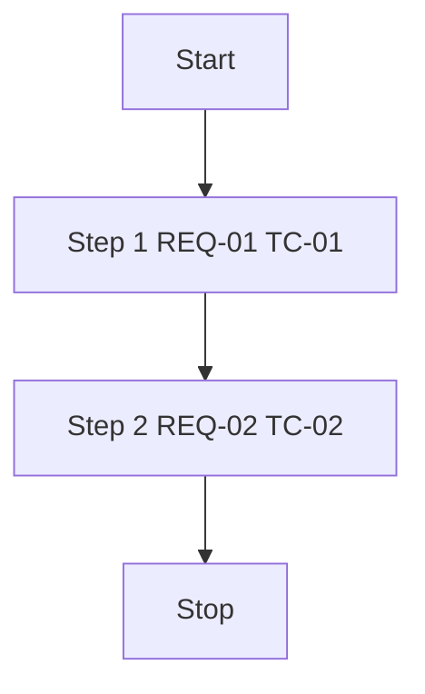
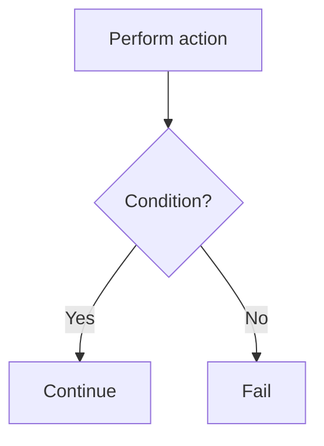
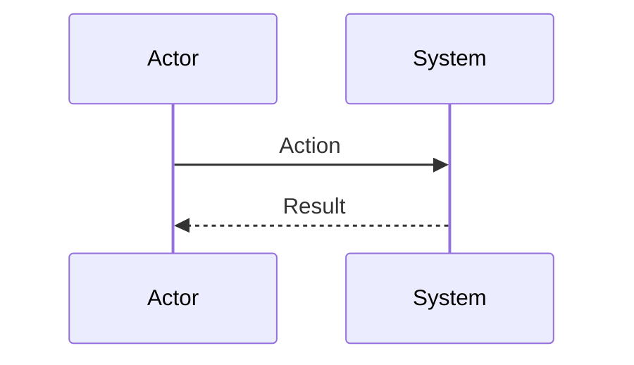

# Logic diagrams: [TITLE]

| Field | Value |
|-------|-------|
| Spec | [link to specs/*.md](../specs/) |
| Test cases | [link to testcases/*.md](../testcases/) |

> Put Mermaid in fenced `mermaid` blocks. Label nodes with `REQ-*` / `TC-*` for traceability. Ship `*.en.md` and `*.zh-Hant.md`.

## 1. High-level flow

## 2. Decisions / error paths

## 3. Sequence (optional)

